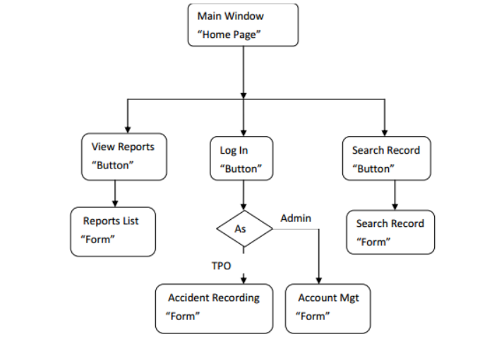
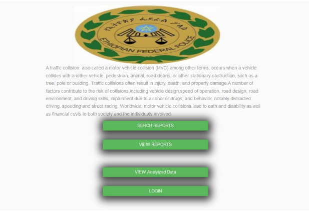
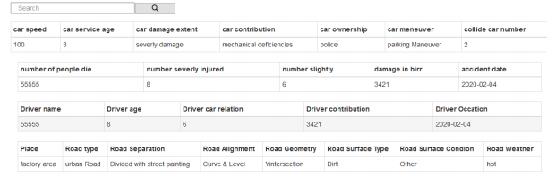
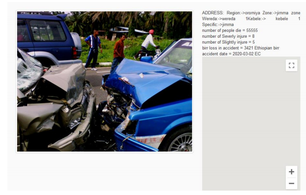
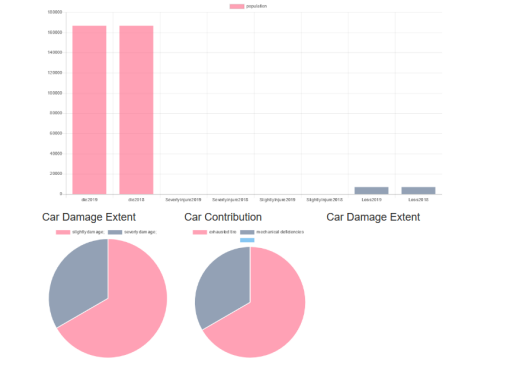
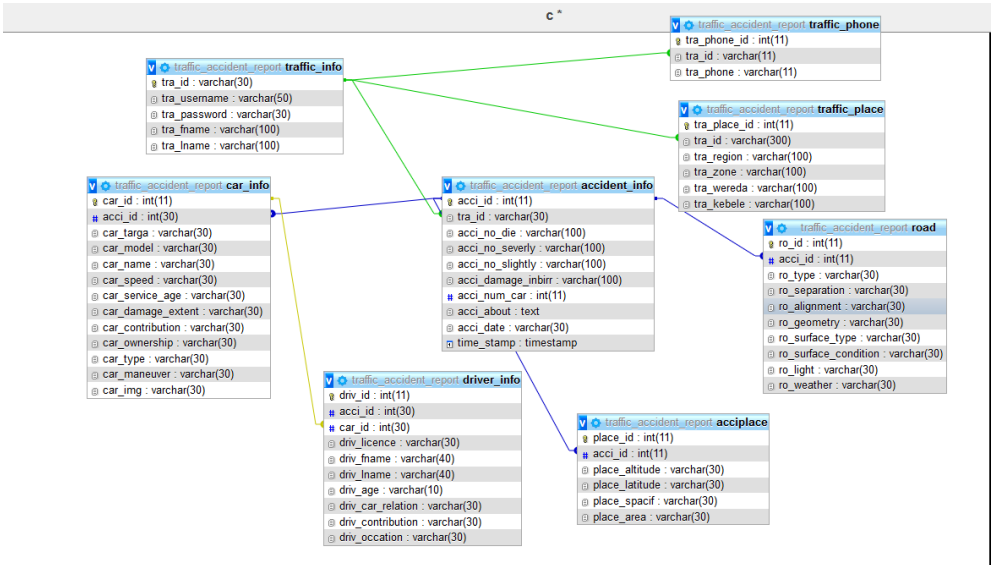
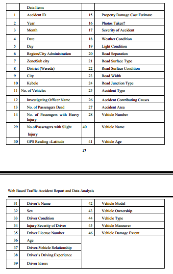

## Web Based Traffic Accident Report and Data Analysis
## hierarchical organization of user interface 

## Home page 

## The search reports

## The View Reports
 

 
## sample screenshot of analyses report
 

 ##  Relations between tables in Relational database
 

Abstract: 
Nowadays traffic accident is a national concern which touches  every part of the society, in order 
to access reliable information and data analysis of an accident cause, using digital reporting and 
analysis system is compulsory.  This project work has designed and implemented a  Web Based 
Road Traffic Accident Reporting System (WBRTARS) which will  enable traffic police offices 
and  other  road  safety  stakeholders  to  get  summarized  online  traffic  accident  information  at 
various  levels  easily  and  quickly.  The  system  has  different  subsystem  to  meet  its  core 
functionalities. An administration subsystem authenticates traffic police officers to login to the 
system and  to  execute their defined task. The accident registration sub system allows the traffic 
police officer to enter and submit road traffic accident details using a simple to use Wizard based 
interface. A report subsystem enables any interested users of the system to view some predefined 
reports  and  find  particular  accident  records  and  it  can  also  display  an  accident  location  on 
Google map.

##  Data Items for the new Proposed System

